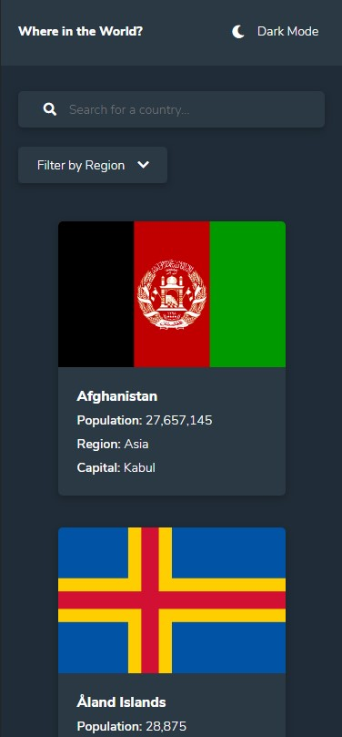

# Frontend Mentor - REST Countries API with color theme switcher solution

This is a solution to the [REST Countries API with color theme switcher challenge on Frontend Mentor](https://www.frontendmentor.io/challenges/rest-countries-api-with-color-theme-switcher-5cacc469fec04111f7b848ca). Frontend Mentor challenges help you improve your coding skills by building realistic projects. 

## Table of contents

- [Overview](#overview)
  - [The challenge](#the-challenge)
  - [Screenshot](#screenshot)
  - [Links](#links)
- [My process](#my-process)
  - [Built with](#built-with)
  - [What I learned](#what-i-learned)
  - [Continued development](#continued-development)
  - [Useful resources](#useful-resources)

## Overview

### The challenge

Users should be able to:

- See all countries from the API on the homepage
- Search for a country using an `input` field
- Filter countries by region
- Click on a country to see more detailed information on a separate page
- Click through to the border countries on the detail page
- Toggle the color scheme between light and dark mode *(optional)*

### Screenshot
#### Desktop View

#### Mobile View

### Links

- Solution URL: [Solution](https://www.frontendmentor.io/solutions/countries-api-vuevuex-router-scss-VCKe8ij1k)
- Live Site URL: [JS Countries API](https://js-countries-api.netlify.app/)

## My process

### Built with

- Semantic HTML5 markup
- CSS custom properties
- Vue JS
- Vuex
- Vue Router
- Git

### What I learned

Overall in this project I have learned a lot of new valuable things, some of which are the ability to use Vuex, auto-search completion and filtering a list.

### Continued development

The use of local-storage to save the user's theme colour's preference. 

### Useful resources

- [Auto-Search Completion](https://www.digitalocean.com/community/tutorials/vuejs-vue-autocomplete-component) - This helped to learn how to make use of some Vue properties but also how to create an auto-search completion component.
